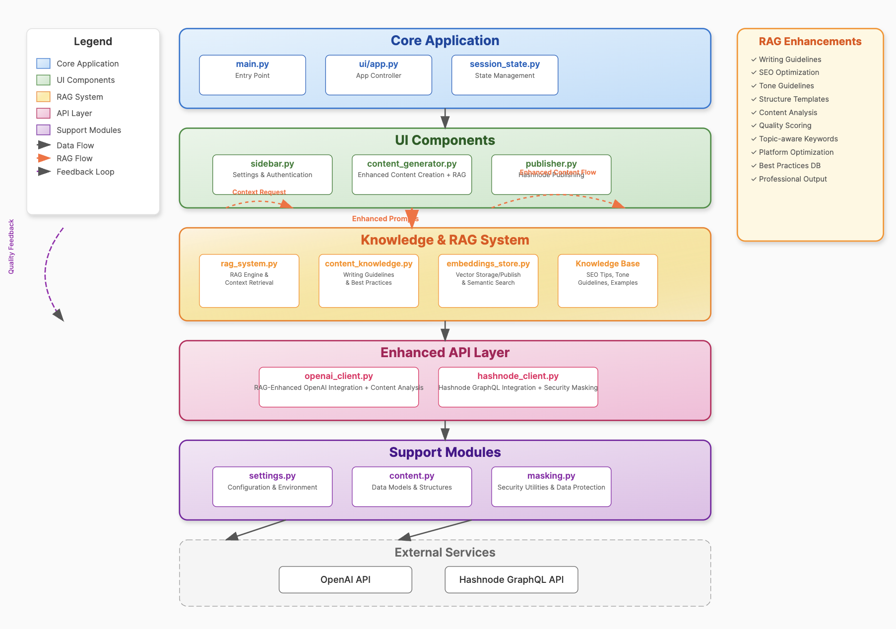

# ProsePilot AI

A full-stack AI content generation tool built with Python and Streamlit that combines RAG (Retrieval-Augmented Generation) with OpenAI's language models to create professional, high-quality content and publish directly to publishing platforms.

## 🌫️ Overview

ProsePilot AI is an intelligent writing assistant that transforms your ideas into polished, publishable content in minutes. By combining OpenAI's powerful language models with a comprehensive knowledge base of writing best practices, SEO optimization, and platform-specific guidelines, ProsePilot AI ensures every piece of content meets professional standards.

Perfect for technical writers, developers, bloggers, and content creators looking to streamline their content workflow while maintaining quality.

## 🏛️ Architecture

_Enhanced architecture featuring RAG (Retrieval-Augmented Generation) for intelligent content creation_



## ✨ Features

### **AI-Powered Content Generation with RAG Enhancement**

- **Intelligent Context Retrieval**: Automatically enhances prompts with relevant writing guidelines, SEO tips, and best practices
- **Professional Structure**: Content follows industry-standard structures for different content types
- **SEO Optimization**: Built-in SEO best practices and keyword optimization
- **Platform Optimization**: Hashnode-specific formatting and publishing guidelines

### **Content Types & Customization**

- **Multiple Content Types**: Blog posts, technical articles, tutorials, opinion pieces, and custom content
- **Tone Adaptation**: Professional, casual, enthusiastic, informative, and technical tones
- **Smart Length Control**: Intelligent word count management with post-processing enforcement
- **Quality Analysis**: Real-time content analysis with scoring for structure, SEO, and readability

### **Publishing & Export**

- **Direct Hashnode Publishing**: Publish content as drafts directly to your Hashnode blog
- **Multiple Export Options**: Download content as Markdown or text files
- **Content Analysis Dashboard**: Detailed metrics and quality scores
- **Conversation History**: Track and review your content generation sessions

### **Enhanced User Experience**

- **RAG-Enhanced Generation**: Writing guidelines and best practices automatically applied
- **Content Quality Scoring**: Structure, SEO, and readability analysis
- **Smart Image Reference Removal**: Automatic cleanup of unwanted image attributions
- **Security Features**: Masked API keys and sensitive data protection

## 📦 Requirements

- Python 3.7+
- OpenAI API key
- Hashnode Account API key
- Hashnode Publication ID

## Setup Instructions

### 1. Installation

```bash
# Clone the repository or download the code
git clone https://github.com/sheygs/prosepilot-ai.git
cd prosepilot-ai

# Create and activate a virtual environment
python3 -m venv venv
source venv/bin/activate  # On Windows, use: venv\Scripts\activate

# Install dependencies
pip3 install -r requirements.txt
```

### 2. API Keys Setup

Rename `.env.sample` file to `.env` file in the project directory and populate the required placeholders:

```
OPENAI_API_KEY=your_openai_api_key_here
HASHNODE_API_KEY=your_hashnode_api_key_here
HASHNODE_PUBLICATION_ID=your_hashnode_publication_id_here
```

### 3. Getting Your API Keys

#### OpenAI API Key

1. Go to [OpenAI Platform](https://platform.openai.com/)
2. Sign up or log in
3. Navigate to the API section
4. Create a new API key

#### Hashnode API Key

1. Log in to [Hashnode](https://hashnode.com/)
2. Go to your profile picture → Developer Settings
3. Click "Generate New Token" in the Personal Access Tokens section
4. Copy the token (you won't be able to see it again)

#### Hashnode Publication ID (Required)

1. Log in to [Hashnode](https://hashnode.com/)
2. Go to your dashboard
3. Click on "Publications" in the left sidebar
4. Select your publication
5. Look at the URL: `https://hashnode.com/dashboard/publications/[YOUR_PUBLICATION_ID]/...`
6. Copy the ID portion from the URL

### 4. Running the Application

```bash
streamlit run main.py
```

Your web browser should open automatically to `http://localhost:8501`.

## 🚀 Usage Guide

### Enhanced Content Generation

1. **Setup**: Enter your OpenAI API key in the sidebar
2. **Connect to Hashnode**: Add your Hashnode API key and publication ID
3. **Configure Content**:
   - Select content type (Blog Post, Technical Article, Tutorial, etc.)
   - Choose tone and writing style
   - Set maximum word count
4. **Generate**: Enter your prompt and click "Generate Enhanced Content"
5. **Review Quality**: Check the content analysis scores for structure, SEO, and readability

### Publishing to Hashnode

1. **Review Generated Content**: Ensure quality scores meet your standards
2. **Add Publishing Details**:
   - Enter title and optional subtitle
   - Search and select relevant tags
   - Choose target publication (if you have multiple)
3. **Publish**: Click "Publish to Hashnode" to create a draft
4. **Final Review**: Go to your Hashnode dashboard to review and publish the draft

### Content Quality Features

- **Overall Quality Score**: Comprehensive scoring out of 100
- **Structure Analysis**: Checks content organization and flow
- **SEO Optimization**: Validates SEO elements and keyword usage
- **Readability Assessment**: Analyzes sentence structure and complexity
- **Platform Readiness**: Ensures Hashnode-compatible formatting

## Important Notes

- **Publication ID is Required**: You must provide a valid Hashnode publication ID to publish content
- **Drafts Only**: The app creates drafts in Hashnode which you must manually publish from your Hashnode dashboard
- **API Key Security**: Your API keys are masked in the interface for security
- **Content Length**: Be mindful of token limits in the OpenAI models when generating long content

## 🪜 Project Structure

```
prosepilot-ai/
├── main.py                     # entry point
├── config/
│   └── settings.py            # configs
├── api/
│   ├── openai_client.py       # OpenAI integration with RAG
│   └── hashnode_client.py     # Hashnode API integration
├── knowledge/                 # RAG System
│   ├── rag_system.py         # RAG implementation and context retrieval
│   ├── content_knowledge.py  # writing guidelines and best practices
│   └── embeddings_store.py   # vector storage for semantic search
├── models/
│   └── content.py            # Data models for content structure
├── utils/
│   └── masking.py            # security utilities
└── ui/
    ├── app.py                # Main UI controller
    ├── components/           # UI components
    └── state/               # session state management
```

## ☁️ Deployment Options

### Streamlit Cloud

1. Push your code to GitHub
2. Go to [Streamlit Cloud](https://streamlit.io/cloud)
3. Deploy your app
4. Add your API keys as secrets

### Docker

```bash
# Build the Docker image
docker build -t prosepilot-ai .

# Run the container
docker run -p 8501:8501 prosepilot-ai
```

## 🔧 Troubleshooting

### Common Issues

- **Word Limit Exceeded**: The app now includes intelligent word count enforcement
- **Authentication Errors**: Ensure your API keys have the correct permissions
- **Publication ID Issues**: Use the "Load My Publications" feature for automatic detection
- **Content Generation Errors**: Check OpenAI API quota and token limits
- **Image References**: Unwanted image attributions are automatically removed

### API Changes

- **Hashnode API**: Uses the latest GraphQL endpoint (`gql.hashnode.com`)
- **Content Analysis**: Enhanced analysis provides detailed quality metrics
- **Security**: All sensitive data is masked in the interface

## Improvement Points

- **Knowledge Base Expansion**: Add more writing guidelines and best practices
- **New Content Types**: Implement support for additional content formats
- **Platform Integration**: Add support for other publishing platforms
- **UI Enhancements**: Improve the user interface and experience
- **Performance Optimization**: Enhance the RAG system for better performance

## License

This project is available under the MIT License.

## 💪 Acknowledgments

- **OpenAI** for providing powerful language models
- **Hashnode** for the publishing platform and API
- **Streamlit** for the excellent web framework
